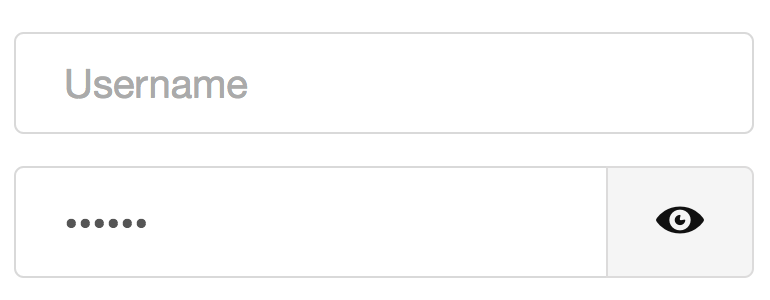
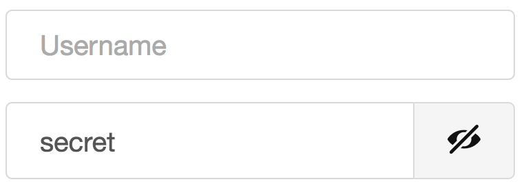

# ng2-show-hide-password

## Add a show hide button to password input fields

Add split input button to password or text input. Toggles input type between "text" and "password". 

#### :warning: Requires 
* **Angular 2** `>=4.0.0`
* **Bootstrap 4** `v6`

#### Optional Icons
* [fontawesome](http://fontawesome.io/)
* [entypo](http://entypo.com/)

### Installation

```
$ npm install https://github.com/osahner/ng2-show-hide-password.git --save
```

### Example

```ts
// app.module.ts
import { ShowHidePasswordModule } from 'ng2-show-hide-password';
...
@NgModule({
  ...
  imports: [
    ShowHidePasswordModule,
  ],
  ...
})
```

```html
<show-hide-password size="lg" icon="entypo">
  <input type="password" name=... />
</show-hide-password>
```

Password hidden | Password exposed
------------ | -------------
 | 


### Attributes

* **size**: `sm`, `lg` or nothing
* **icon**: `fontawesome`, `entypo` or nothing (= checkbox)

### LICENCE

MIT
